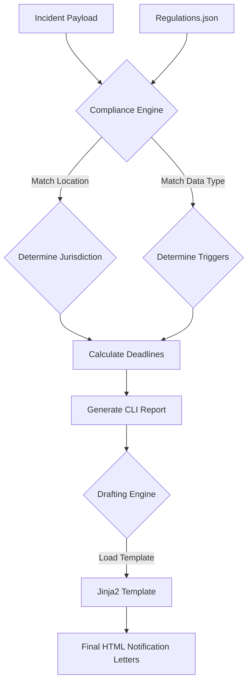

# Automated Breach Notification Engine


**A programmable legal orchestrator that calculates regulatory deadlines and auto-drafts breach notifications based on jurisdiction (GDPR, CCPA, NY SHIELD, etc.).**

Managing a data breach is a race against the clock. Different laws trigger different deadlines:
* **GDPR:** 72 hours.
* **Puerto Rico:** 10 days.
* **Florida:** 30 days.
* **California:** "Without unreasonable delay."

This engine eliminates the guesswork. It ingests an incident payload, queries a JSON database of **50+ US State & International laws**, and instantly generates the required legal artifacts.

## Key Features

* **Multi-Jurisdictional Logic:** Includes a `regulations.json` database covering **GDPR** and **all 50 US States** (plus DC/Puerto Rico).
* **Deadline Calculator:** Automatically calculates the exact date/time you must notify regulators based on the incident timestamp and urgency.
* **Auto-Drafting Engine:** Uses **Jinja2** templates to generate formatted HTML notification letters tailored to the specific regulator (e.g., "To the California Attorney General") and incident details.
* **Context-Aware:** Distinguishes between "Consumer Notice" vs. "Regulator Notice" and filters based on trigger data (e.g., "Medical" data triggers HIPAA/State Health laws; "SSN" triggers State AGs).

## Architecture



## Project Structure

```text
breach-notification-engine/
├── config/
│   └── regulations.json     # Database of 50+ laws and deadlines
├── src/
│   ├── compliance_engine.py # Main Logic: Assesses incidents & calculates deadlines
│   ├── drafter.py           # Drafting Engine: Generates HTML letters
│   └── predict.py           # ML Module: Predicts potential fines (Standalone)
├── templates/
│   └── us_consumer_notice.html # Base template for consumer notices
└── requirements.txt
```

## Installation

1. **Clone the repository:**
   ```bash
   git clone [https://github.com/codyjkeller/breach-notification-engine.git](https://github.com/codyjkeller/breach-notification-engine.git)
   cd breach-notification-engine
   ```

2. **Install dependencies:**
   ```bash
   pip install -r requirements.txt
   ```

## Usage

### 1. Run the Compliance Engine
To simulate a breach assessment, run the main engine. It includes a sample incident payload (simulating a breach affecting California and New York with medical data).

```bash
python src/compliance_engine.py
```

**Output:**
* **CLI Report:** A rich text table displaying all legal obligations, deadlines, and urgency status.
* **Drafted Letters:** HTML files (e.g., `draft_notice_California_20260217.html`) will be generated in the root directory for any jurisdiction requiring consumer notice.

### 2. Run the Fine Predictor (ML)
To estimate potential financial liability based on historical regulatory actions, run the predictor tool. You will be prompted to enter the number of records exposed and company revenue.

```bash
python src/predict.py
```

## License

This project is licensed under the terms of the **MIT License**.

> Permission is hereby granted, free of charge, to any person obtaining a copy of this software and associated documentation files (the "Software"), to deal in the Software without restriction...

See the [LICENSE](LICENSE) file for the full text.

## Legal Disclaimer

**IMPORTANT: FOR EDUCATIONAL AND SIMULATION PURPOSES ONLY.**

This software (`breach-notification-engine`) is a proof-of-concept tool designed to demonstrate the automation of regulatory compliance workflows. It is **not** a substitute for professional legal advice.

* **No Attorney-Client Relationship:** Use of this tool does not create an attorney-client relationship.
* **Accuracy:** While the `regulations.json` database is based on real statutes, laws change frequently. The deadlines and obligations calculated by this tool may not reflect the most current legal requirements.
* **Liability:** The authors and contributors are not liable for any direct, indirect, or consequential damages arising from the use of this software. Always consult with a qualified attorney or privacy professional before making decisions regarding data breach notifications.
